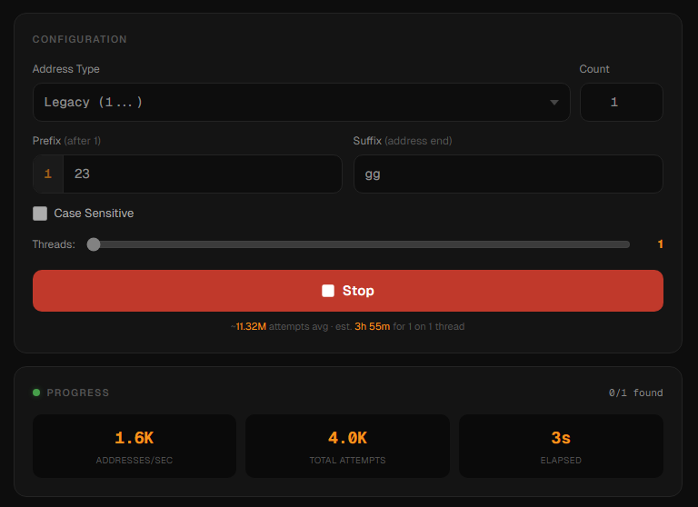
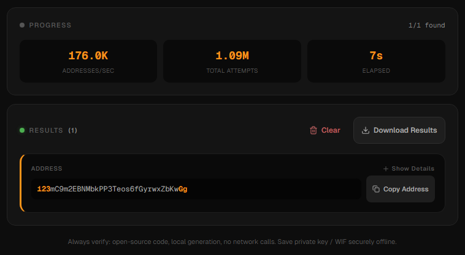

# BTC Vanity PWA

<p align="center">
  <strong>Generate Bitcoin vanity addresses directly in your browser.</strong><br/>
  Local-only key generation, multi-core Web Workers, and offline-ready PWA support.
</p>

<p align="center">
  <a href="https://github.com/chris-iwolf/btc-vanity-pwa/blob/main/LICENSE"></a>
  
  
  
</p>

## Why This Project

BTC Vanity PWA is a privacy-first vanity address generator that runs entirely on your device.

- No backend required
- No private key uploads
- No network dependency during generation after first load
- Works as an installable Progressive Web App

## Features

- Generate vanity addresses for:
  - Legacy (P2PKH, starts with `1`)
  - Native SegWit (P2WPKH, starts with `bc1q`)
  - Taproot (P2TR, starts with `bc1p`)
- Prefix and suffix matching
- Multi-threaded mining using Web Workers
- Real-time attempts/sec and progress stats
- Batch result generation with copy/download actions
- Service worker caching for offline use

## Screenshots





## Quick Start

### Prerequisites

- Node.js 20+
- pnpm (recommended)

### Install and run

```bash
git clone https://github.com/chris-iwolf/btc-vanity-pwa.git
cd btc-vanity-pwa
pnpm install
pnpm dev
```

Open `http://localhost:3000`.

### Production build

```bash
pnpm build
pnpm start
```

## Usage

1. Select address type: Legacy, SegWit, or Taproot.
2. Enter your desired custom prefix and/or suffix.
3. Choose how many matches to find.
4. Set worker thread count.
5. Start mining and monitor attempts/sec.
6. Copy or export generated results.

## Security Notes

- Private keys are generated in-browser and stay local to your device.
- Always verify generated addresses before funding.
- For meaningful amounts, run from your own local build and trusted machine.
- Treat exported private keys and WIFs as highly sensitive secrets.

## Support The Project

If this project helps you, tips are appreciated.

BTC donation address (Taproot):

`bc1pyd4l4l964dxz80d5ql4hy55m6xfs7v30n5ctj3h4m5qsauuk5hsqvhappy`

Wallet deep link:
<a href="bitcoin:bc1pyd4l4l964dxz80d5ql4hy55m6xfs7v30n5ctj3h4m5qsauuk5hsqvhappy">Send Tip [bc1p...happy]</a>

You can also support by starring the repo:

- https://github.com/chris-iwolf/btc-vanity-pwa

## Tech Stack

- Next.js 16 (App Router)
- React 19
- TypeScript
- Tailwind CSS + shadcn/ui
- Web Workers + Service Worker

## Deployment

This is a client-heavy web app and can be deployed to:

- Vercel
- Netlify
- Cloudflare Pages
- GitHub Pages (with static export configuration)

## Contributing

Contributions are welcome.

1. Fork the repository
2. Create a feature branch
3. Commit and push
4. Open a pull request

## License

Licensed under the Apache License 2.0.
See [LICENSE](./LICENSE).

## Disclaimer

This software is provided "as is" without warranty of any kind. You are solely responsible for generated keys, imported wallets, and any funds sent to derived addresses.